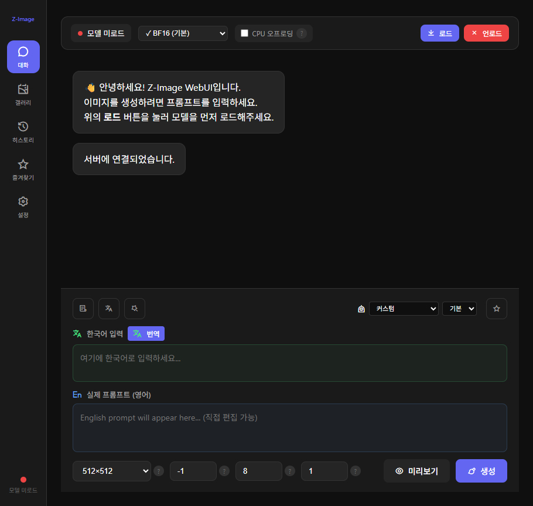
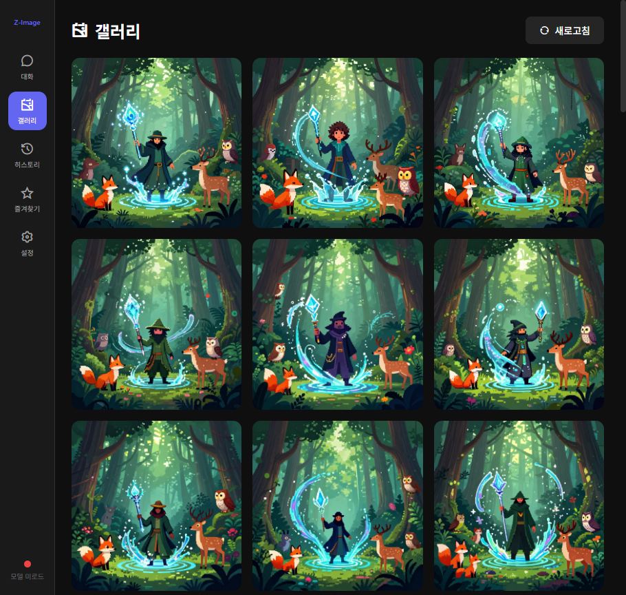
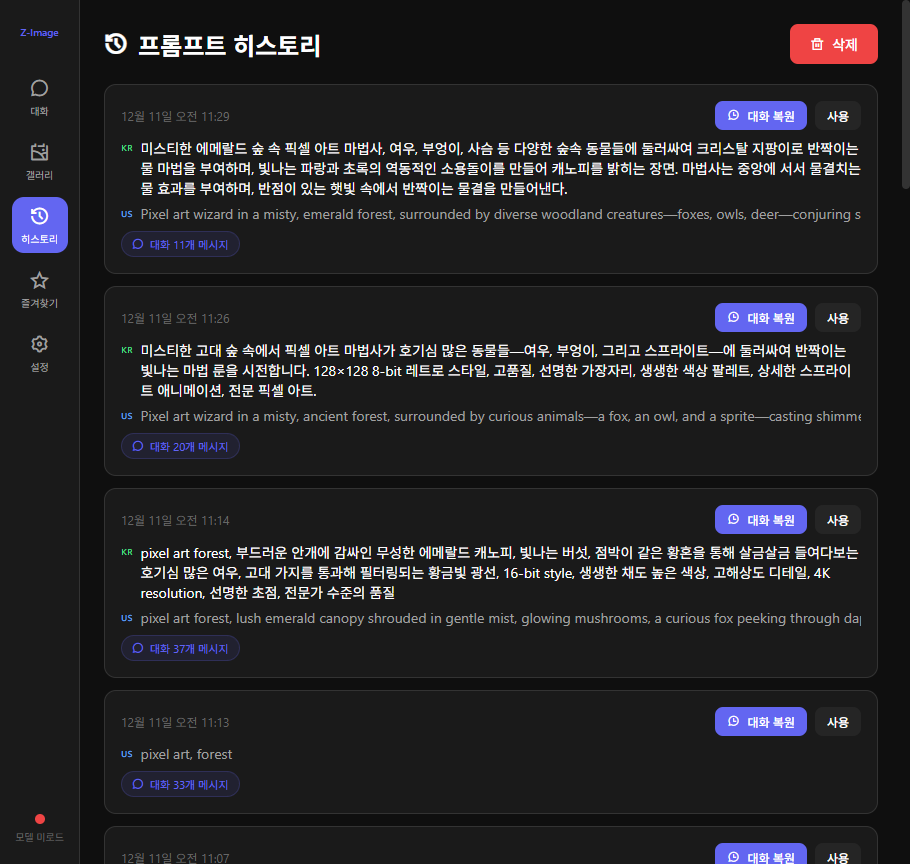
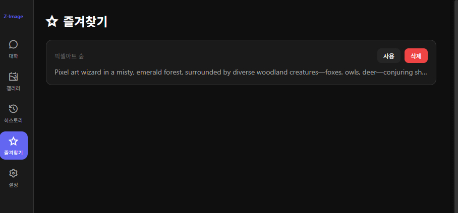
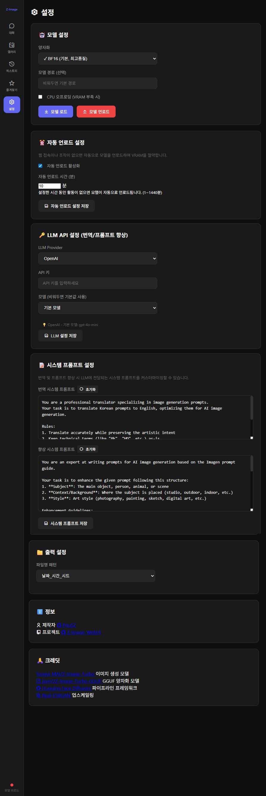

# 📚 Z-Image WebUI 사용 가이드

이 문서는 Z-Image WebUI의 모든 기능을 자세히 설명합니다.

---

## 📑 목차

1. [시작하기](#-시작하기)
2. [대화 탭 - 이미지 생성](#-대화-탭---이미지-생성)
3. [갤러리 탭](#-갤러리-탭)
4. [히스토리 탭](#-히스토리-탭)
5. [즐겨찾기 탭](#-즐겨찾기-탭)
6. [설정 탭](#-설정-탭)

---

## 🚀 시작하기

### 1. 프로그램 실행

**Windows:**
```batch
# 첫 실행 시 (패키지 설치)
Setup.bat

# 이후 실행
Run.bat
```

**Linux/macOS:**
```bash
source venv/bin/activate
python app.py
```

### 2. 웹 브라우저 접속

프로그램이 실행되면 자동으로 브라우저가 열리거나, 수동으로 접속합니다:
- **URL:** http://localhost:7860

### 3. 모델 로드

> ⚠️ **중요:** 이미지를 생성하기 전에 반드시 모델을 먼저 로드해야 합니다!



---

## 💬 대화 탭 - 이미지 생성

대화 탭은 Z-Image WebUI의 메인 화면입니다. 여기서 프롬프트를 입력하고 이미지를 생성합니다.

### 모델 컨트롤 바

화면 상단에 위치한 모델 상태 및 제어 영역입니다.

| 요소 | 설명 |
|-----|------|
| **모델 상태** | 🔴 빨간색 = 미로드, 🟢 녹색 = 로드됨 |
| **양자화 선택** | BF16(기본), Q8, Q6, Q4 등 선택 가능 |
| **CPU 오프로딩** | VRAM이 부족할 때 체크 (RAM 사용) |
| **로드 버튼** | 모델을 메모리에 로드 |
| **언로드 버튼** | 모델을 메모리에서 해제 |

#### 양자화 옵션 가이드

| 옵션 | VRAM 사용량 | 품질 | 추천 대상 |
|-----|------------|-----|----------|
| BF16 (기본) | ~12GB | ⭐⭐⭐⭐⭐ 최고 | 고성능 GPU |
| Q8_0 | ~7.2GB | ⭐⭐⭐⭐ 고품질 | RTX 3070 이상 |
| Q6_K | ~6.1GB | ⭐⭐⭐⭐ 고품질 | RTX 3060 이상 |
| **Q4_K_M** | ~5GB | ⭐⭐⭐ 균형 | **일반 사용자 추천** |
| Q4_K_S | ~4.5GB | ⭐⭐⭐ 양호 | RTX 2060 이상 |
| Q3_K_M | ~4GB | ⭐⭐ 보통 | 저사양 GPU |
| Q3_K_S | ~3.8GB | ⭐⭐ 보통 | 최저 VRAM |

> 💡 **Tip:** 처음 사용 시 Q4_K_M을 추천합니다. 품질과 VRAM 사용량의 균형이 좋습니다.

---

### 프롬프트 입력

#### 한국어 입력 영역

```
여기에 한국어로 입력하세요...
```

- 한국어로 원하는 이미지를 설명합니다
- **번역** 버튼을 클릭하면 자동으로 영어로 번역됩니다

#### 영어 프롬프트 영역

```
English prompt will appear here... (직접 편집 가능)
```

- 실제 이미지 생성에 사용되는 프롬프트
- 번역된 결과가 여기에 표시됩니다
- 직접 영어로 작성하거나 수정 가능

---

### 프롬프트 도구 버튼

| 버튼 | 아이콘 | 기능 |
|-----|-------|------|
| **템플릿** | 📋 | 미리 정의된 프롬프트 템플릿 선택 |
| **번역** | 🌐 | 한국어 → 영어 자동 번역 |
| **AI 향상** | ✨ | 간단한 프롬프트를 상세하게 확장 |

#### 템플릿 사용법

1. 📋 템플릿 버튼 클릭
2. 카테고리 선택 (인물, 풍경, 애니메이션 등)
3. 원하는 템플릿 클릭
4. 프롬프트가 자동으로 입력됩니다

#### 번역 사용법

1. 한국어 입력란에 원하는 내용 작성
   - 예: "마법의 숲에서 요정이 날아다니는 장면"
2. 🌐 번역 버튼 클릭
3. 영어 프롬프트가 자동 생성됩니다

#### AI 향상 사용법

1. 간단한 프롬프트 입력
   - 예: "고양이"
2. ✨ AI 향상 버튼 클릭
3. 상세한 프롬프트로 확장됩니다
   - 예: "A fluffy orange cat with bright green eyes, sitting elegantly on a velvet cushion, soft natural lighting, detailed fur texture, photorealistic style"

> ⚠️ 번역/AI 향상 기능을 사용하려면 **설정 탭**에서 LLM API를 먼저 설정해야 합니다.

---

### LLM 모델 선택

프롬프트 도구 영역 오른쪽에 있는 드롭다운입니다.

- **Provider 선택:** OpenAI, Groq, Ollama 등
- **모델 선택:** 각 Provider의 사용 가능한 모델

> 💡 **Tip:** 빠른 번역에는 GPT-4o-mini나 Groq의 Llama 모델이 좋습니다.

---

### 생성 설정

화면 하단의 설정 영역입니다.

| 설정 | 설명 | 기본값 | 권장 |
|-----|------|-------|------|
| **해상도** | 이미지 크기 | 512×512 | 용도에 따라 |
| **시드** | 랜덤 시드값 | -1 (랜덤) | 재현 시 고정값 |
| **스텝** | 생성 단계 수 | 8 | 4~12 |
| **개수** | 한 번에 생성할 이미지 수 | 1 | 1~4 |

#### 해상도 옵션

| 옵션 | 크기 | 용도 |
|-----|-----|------|
| 512×512 | 정사각형 | 기본, 빠른 생성 |
| 768×768 | 정사각형 | 중간 품질 |
| 1024×1024 | 정사각형 | 고품질, VRAM 많이 사용 |
| 512×768 | 세로형 | 인물, 세로 구도 |
| 768×512 | 가로형 | 풍경, 가로 구도 |
| 커스텀 | 사용자 지정 | 특수한 비율 필요 시 |

#### 시드(Seed) 이해하기

- **-1:** 매번 다른 랜덤 이미지 생성
- **고정값 (예: 12345):** 같은 프롬프트로 동일한 이미지 재현 가능

> 💡 **Tip:** 마음에 드는 이미지가 나왔다면 시드 값을 기록해두세요!

#### 스텝(Steps) 가이드

| 스텝 수 | 속도 | 품질 |
|--------|-----|-----|
| 4 | ⚡ 매우 빠름 | 기본 |
| 8 | ⚡ 빠름 | 양호 (기본값) |
| 12 | 보통 | 좋음 |
| 20+ | 느림 | 차이 미미 |

> 💡 Z-Image는 Turbo 모델이라 4~12 스텝으로도 충분합니다.

---

### 생성 버튼

| 버튼 | 기능 |
|-----|------|
| **미리보기** 👁️ | 256×256 저해상도로 빠르게 테스트 |
| **생성** 🎨 | 설정된 해상도로 본격 생성 |

#### 추천 워크플로우

1. **미리보기**로 프롬프트 테스트
2. 결과 확인 후 프롬프트 수정
3. 만족스러우면 **생성**으로 고해상도 이미지 생성

---

## 🖼️ 갤러리 탭

생성된 모든 이미지를 확인하고 관리합니다.



### 기능

| 기능 | 설명 |
|-----|------|
| **이미지 그리드** | 생성된 이미지 썸네일 보기 |
| **새로고침** | 갤러리 목록 새로 불러오기 |
| **이미지 클릭** | 큰 화면으로 이미지 보기 |

### 이미지 상세 보기

이미지를 클릭하면 모달 창이 열립니다:

- **원본 크기** 이미지 확인
- **메타데이터 정보** 확인
  - 프롬프트
  - 시드값
  - 해상도
  - 생성 일시
  - 사용한 모델/양자화

### 이미지 저장 위치

생성된 이미지는 `outputs/` 폴더에 자동 저장됩니다.

```
outputs/
├── 20241211_143052_123456.png
├── 20241211_143120_789012.png
└── ...
```

---

## 📜 히스토리 탭

사용한 프롬프트의 기록을 관리합니다.



### 히스토리 항목 구성

각 히스토리 항목에는 다음 정보가 표시됩니다:

| 표시 | 설명 |
|-----|------|
| **날짜/시간** | 프롬프트 사용 시간 |
| **KR** | 한국어 프롬프트 (있는 경우) |
| **US** | 영어 프롬프트 |
| **대화 N개 메시지** | 해당 세션에서 생성한 이미지 수 |

### 버튼 기능

| 버튼 | 기능 |
|-----|------|
| **대화 복원** | 해당 프롬프트로 새 대화 시작 + 이전 이미지 표시 |
| **사용** | 프롬프트만 입력란에 복사 |
| **삭제** 🗑️ | 전체 히스토리 삭제 (주의!) |

### 사용 예시

1. 이전에 좋은 결과가 나왔던 프롬프트 찾기
2. **사용** 버튼 클릭
3. 프롬프트가 입력란에 자동 입력
4. 필요시 수정 후 다시 생성

> 💡 **Tip:** 히스토리에서 좋은 프롬프트를 발견하면 **즐겨찾기**에 저장하세요!

---

## ⭐ 즐겨찾기 탭

자주 사용하는 프롬프트를 저장하고 관리합니다.



### 즐겨찾기 추가 방법

1. 대화 탭에서 프롬프트 입력
2. 입력 영역 옆의 ⭐ 버튼 클릭
3. 즐겨찾기 이름 입력
4. **저장** 클릭

### 즐겨찾기 사용

| 버튼 | 기능 |
|-----|------|
| **사용** | 프롬프트를 입력란에 복사 |
| **삭제** | 즐겨찾기에서 제거 |

### 활용 팁

- **스타일 프롬프트 저장:** "8-bit pixel art style, retro game aesthetic"
- **품질 향상 프롬프트:** "high quality, detailed, 4K resolution, professional"
- **자주 쓰는 주제:** "magical forest, mystical atmosphere"

---

## ⚙️ 설정 탭

모든 설정을 관리하는 탭입니다.



---

### 🤖 모델 설정

이미지 생성 모델 관련 설정입니다.

| 설정 | 설명 |
|-----|------|
| **양자화** | 모델 압축 레벨 선택 (VRAM에 따라) |
| **CPU 오프로딩** | VRAM 부족 시 RAM 사용 |

**버튼:**
- **모델 로드:** 선택한 설정으로 모델 로드
- **모델 언로드:** 메모리에서 모델 해제

---

### ⏰ 자동 언로드 설정

비활성 시 자동으로 모델을 언로드하여 VRAM을 절약합니다.

| 설정 | 설명 | 기본값 |
|-----|------|-------|
| **자동 언로드 활성화** | 기능 켜기/끄기 | 켜짐 |
| **자동 언로드 시간** | 비활성 후 언로드까지 대기 시간 | 10분 |

> 💡 **Tip:** 다른 작업을 하다가 다시 이미지를 생성할 때 모델을 다시 로드해야 합니다. 자주 사용한다면 시간을 늘리거나 비활성화하세요.

---

### 🔑 LLM API 설정

번역 및 프롬프트 향상 기능에 사용되는 LLM 설정입니다.

#### 지원 Provider

| Provider | 설명 | API 키 필요 |
|----------|-----|------------|
| **OpenAI** | GPT-4o, GPT-4o-mini 등 | ✅ 필요 |
| **Groq** | Llama, Mixtral (빠름!) | ✅ 필요 |
| **Together AI** | 다양한 오픈소스 모델 | ✅ 필요 |
| **OpenRouter** | 여러 모델 통합 | ✅ 필요 |
| **Ollama** | 로컬 LLM | ❌ 불필요 |
| **LM Studio** | 로컬 LLM | ❌ 불필요 |

#### 설정 방법

1. **LLM Provider** 선택
2. **API 키** 입력 (해당 서비스에서 발급)
3. **모델** 선택 (또는 직접 입력)
4. **LLM 설정 저장** 클릭

#### Provider별 설정 예시

**OpenAI:**
```
Provider: OpenAI
API Key: sk-xxxxxxxxxxxxxxxx
Model: gpt-4o-mini (추천, 저렴하고 빠름)
```

**Groq (무료, 빠름):**
```
Provider: Groq
API Key: gsk_xxxxxxxxxxxxxxxx
Model: llama-3.1-8b-instant
```

**Ollama (로컬):**
```
Provider: Ollama
API Key: (비워둠)
Model: llama3.1
```

> 💡 **Tip:** 처음 사용자에게는 Groq를 추천합니다. 무료이고 매우 빠릅니다!

---

### 📝 시스템 프롬프트 설정

LLM에 전달되는 시스템 프롬프트를 커스터마이징합니다.

#### 번역 시스템 프롬프트

한국어 → 영어 번역 시 LLM에게 전달되는 지시사항입니다.

기본 내용:
- 이미지 생성 프롬프트 전문 번역가 역할
- 예술적 의도 보존
- 전문 용어 사용

#### 향상 시스템 프롬프트

프롬프트를 확장/개선할 때 사용되는 지시사항입니다.

기본 내용:
- 이미지 생성 프롬프트 전문가 역할
- 주제, 배경, 스타일, 조명 등 세부 사항 추가
- 구조화된 형식으로 출력

**버튼:**
- **초기화:** 기본 프롬프트로 되돌리기
- **시스템 프롬프트 저장:** 수정된 프롬프트 저장

---

### 📁 출력 설정

생성된 이미지의 파일명 패턴을 설정합니다.

| 패턴 | 예시 |
|-----|------|
| 날짜_시간_시드 | `20241211_143052_123456.png` |
| 프롬프트_시드 | `beautiful_landscape_123456.png` |
| image_번호_시드 | `image_001_123456.png` |

---

### ℹ️ 정보 & 크레딧

프로젝트 정보와 사용된 기술에 대한 크레딧을 확인할 수 있습니다.

---

## 🔧 문제 해결

### 모델 로드가 안 됨

1. VRAM 부족 → 더 낮은 양자화 옵션 선택
2. CPU 오프로딩 활성화
3. 다른 프로그램 종료 후 재시도

### 번역/향상 기능이 안 됨

1. 설정 탭에서 LLM API 키 확인
2. Provider가 올바르게 선택되었는지 확인
3. 인터넷 연결 확인

### 이미지 생성이 느림

1. 스텝 수 줄이기 (4~8 권장)
2. 해상도 낮추기
3. 더 효율적인 양자화 옵션 선택

### VRAM 부족 오류

1. 다른 GPU 사용 프로그램 종료
2. 브라우저 탭 정리
3. CPU 오프로딩 활성화
4. 더 낮은 양자화 선택 (Q3, Q4)

---

## 💡 프로 팁

### 좋은 프롬프트 작성법

1. **구체적으로:** "고양이" → "털이 복슬복슬한 주황색 고양이"
2. **스타일 지정:** "oil painting style", "anime style", "photorealistic"
3. **품질 태그 추가:** "high quality", "detailed", "8K", "masterpiece"
4. **조명 설명:** "soft natural lighting", "dramatic shadows", "golden hour"
5. **구도 설명:** "close-up portrait", "wide angle shot", "bird's eye view"

### 효율적인 워크플로우

1. 미리보기로 빠르게 테스트
2. 마음에 드는 시드 기록
3. 프롬프트 수정 → 다시 테스트
4. 최종 확정 후 고해상도 생성
5. 좋은 프롬프트는 즐겨찾기 저장

### VRAM 절약 팁

1. 생성 후 불필요한 탭 닫기
2. 자동 언로드 기능 활성화
3. 필요할 때만 모델 로드
4. 양자화 모델(Q4_K_M 등) 사용

---

## 📞 추가 도움말

- **GitHub Issues:** 버그 리포트 및 기능 요청
- **README.md:** 설치 및 기본 사용법

---

Made with ❤️ for AI Art Creators

